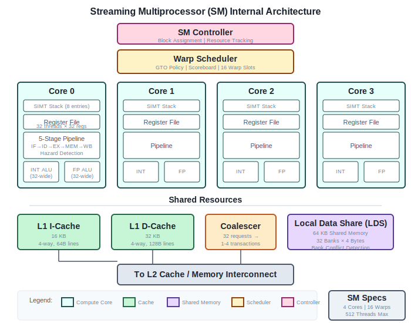
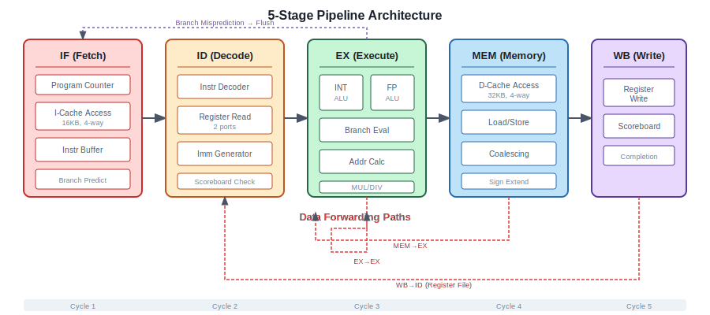
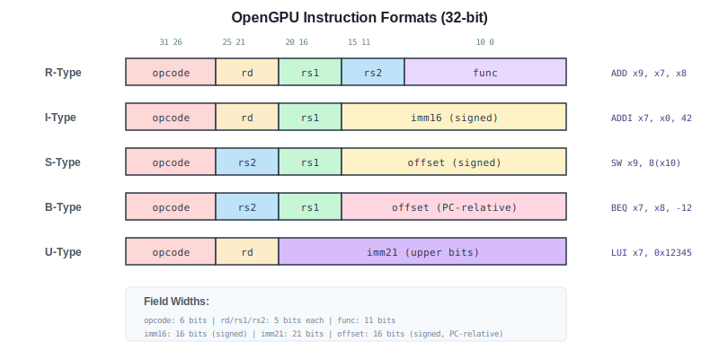

# OpenGPU Architecture Overview

This document describes the complete architecture of OpenGPU, an educational GPU implementation.

## Design Philosophy

OpenGPU is designed with these goals:
1. **Educational clarity** - Every module is well-documented
2. **Progressive complexity** - Start simple, add features incrementally
3. **Real GPU concepts** - Implements actual GPU architecture patterns

## System Overview


OpenGPU consists of:
- **8 Streaming Multiprocessors (SMs)**, each with 4 compute cores
- **32 total cores** executing in SIMT fashion
- **Two-level cache hierarchy** (L1 per SM, shared L2)
- **4 memory controllers** for high bandwidth

## Streaming Multiprocessor (SM)



Each SM contains:

| Component | Specification |
|-----------|--------------|
| Compute Cores | 4 |
| Warps per Core | 4 (16 total per SM) |
| Threads per SM | 512 (16 warps × 32 threads) |
| L1 I-Cache | 16 KB, 4-way |
| L1 D-Cache | 32 KB, 4-way |
| Shared Memory | 64 KB, 32 banks |
| Register File | 64 KB total |

### Warp Scheduling

The warp scheduler uses **Greedy-Then-Oldest (GTO)** policy:
1. Continue issuing from current warp if ready
2. Otherwise, switch to oldest ready warp
3. Stall conditions: RAW hazard, cache miss, barrier

### SIMT Stack

Branch divergence is handled with an 8-entry SIMT stack:

```
┌─────────────────┬──────────────┬─────────────┐
│ Reconverge PC   │ Active Mask  │  Next PC    │
│    (32-bit)     │   (32-bit)   │  (32-bit)   │
└─────────────────┴──────────────┴─────────────┘
```

Algorithm:
1. On divergent branch, push reconvergence point
2. Execute taken path with subset of threads
3. At reconvergence, pop and execute not-taken path
4. Continue with full mask

## Pipeline Architecture



### 5-Stage Pipeline

| Stage | Function | Key Operations |
|-------|----------|----------------|
| IF | Fetch | I-Cache access, branch prediction |
| ID | Decode | Instruction decode, register read |
| EX | Execute | ALU/FPU ops, branch evaluation |
| MEM | Memory | D-Cache access, load/store |
| WB | Writeback | Register write, scoreboard update |

### Hazard Handling

- **Data hazards**: Scoreboard + forwarding
- **Control hazards**: Branch prediction, flush on mispredict
- **Structural hazards**: Multi-cycle ops use functional unit reservations

### Forwarding Paths

```
EX → EX   : Result available next cycle
MEM → EX  : Load data available 2 cycles later
WB → ID   : Via register file (if no forwarding)
```

## Instruction Set Architecture



### Instruction Categories

| Category | Count | Examples |
|----------|-------|----------|
| Integer Arithmetic | 9 | ADD, SUB, MUL, DIV |
| Logical | 7 | AND, OR, XOR, NOT |
| Shift | 6 | SLL, SRL, SRA |
| Comparison | 8 | SLT, SEQ, SNE |
| Memory | 8 | LW, SW, LB, SB |
| Branch | 6 | BEQ, BNE, BLT |
| Jump | 2 | JAL, JALR |
| Floating-Point | 16 | FADD, FMUL, FSQRT |
| GPU Special | 11 | VOTE, SHFL, SYNC |

### Register File

32 registers per thread:

| Register | Name | Description |
|----------|------|-------------|
| x0 | zero | Always 0 |
| x1 | threadIdx | Thread ID in block |
| x2 | blockIdx | Block ID in grid |
| x3 | blockDim | Block dimensions |
| x4 | gridDim | Grid dimensions |
| x5 | warpIdx | Warp ID |
| x6 | laneIdx | Lane in warp |
| x7-x31 | GP | General purpose |

## Memory Hierarchy

### Address Space (32-bit)

```
0x00000000 - 0x0FFFFFFF : Global Memory (256 MB)
0x20000000 - 0x20FFFFFF : Constant Memory (16 MB, cached)
0x30000000 - 0x300FFFFF : Shared Memory (1 MB, per-SM view)
0x40000000 - 0x4FFFFFFF : Local Memory (256 MB, per-thread)
0x80000000 - 0xFFFFFFFF : MMIO / Control (2 GB)
```

### Cache Parameters

| Cache | Size | Associativity | Line Size | Latency |
|-------|------|---------------|-----------|---------|
| L1 I$ | 16 KB | 4-way | 64 B | 1 cycle |
| L1 D$ | 32 KB | 4-way | 128 B | 10-20 cycles |
| L2 | 512 KB | 8-way | 128 B | 100-150 cycles |

### Memory Coalescing

The coalescing unit combines 32 thread requests:

```
Perfect coalescing:   32 sequential words → 1 cache line
Partial coalescing:   2 groups → 2 cache lines
Worst case:           32 scattered → 32 cache lines
```

### Shared Memory Banks

64 KB organized as 32 banks × 4 bytes:
- **No conflict**: Different threads access different banks (1 cycle)
- **Broadcast**: All threads read same address (1 cycle)
- **Bank conflict**: N threads to same bank (N cycles)

## Execution Model

### Thread Hierarchy

```
Grid
├── Block 0
│   ├── Warp 0: Threads 0-31
│   ├── Warp 1: Threads 32-63
│   └── ...
├── Block 1
└── ...
```

### Kernel Launch

1. Host writes kernel parameters to control registers
2. Global scheduler distributes blocks to SMs
3. SM assigns warps to cores
4. Cores execute until all threads complete
5. Status register signals completion

### Synchronization

- **`SYNC`**: Block-level barrier (__syncthreads)
- **`WSYNC`**: Warp-level synchronization
- **Atomics**: ATOM.ADD, ATOM.CAS for memory

## Module Hierarchy

```
opengpu_top
├── host_interface (AXI-Lite)
├── global_scheduler
│   ├── kernel_dispatch
│   └── block_scheduler
├── sm_top [0:7]
│   ├── sm_controller
│   ├── warp_scheduler
│   ├── core_top [0:3]
│   │   ├── simt_stack
│   │   ├── fetch_stage
│   │   ├── decode_stage
│   │   ├── execute_stage
│   │   │   ├── int_alu
│   │   │   └── fp_alu
│   │   ├── memory_stage
│   │   └── writeback_stage
│   ├── l1_icache
│   ├── l1_dcache
│   └── lds (shared memory)
├── l2_cache [0:1]
├── crossbar
└── memory_controller [0:3]
```

## Performance Targets

| Metric | Target |
|--------|--------|
| Clock frequency | 100 MHz (simulation) |
| Peak INT32 throughput | 3.2 GOPS |
| Peak FP32 throughput | 3.2 GFLOPS |
| Memory bandwidth | 25.6 GB/s |
| Max concurrent threads | 4096 |
